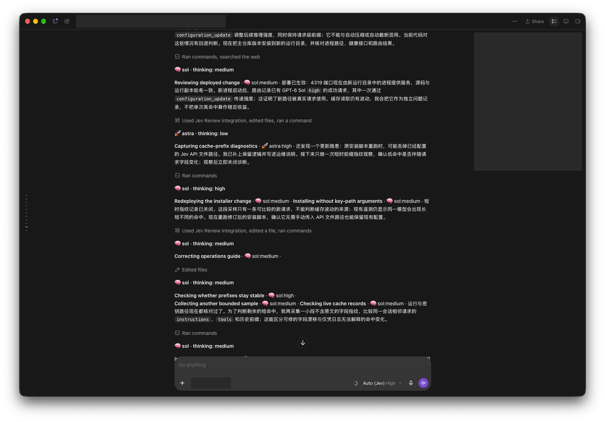
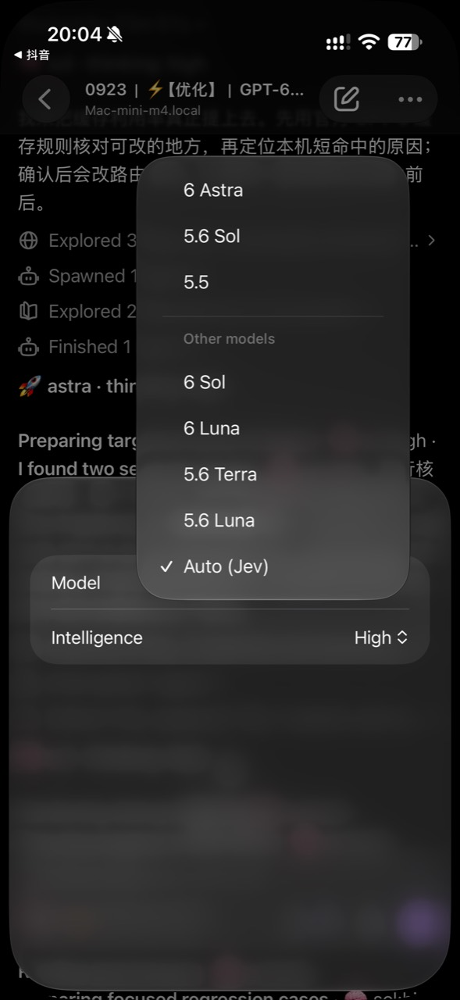

# Jev Codex Router

Contributing? See [CONTRIBUTING.md](CONTRIBUTING.md),
[SECURITY.md](SECURITY.md), and the [release checklist](docs/RELEASING.md).

[](https://github.com/ericwanderlust/jev-codex-router/actions/workflows/ci.yml)

**Designed for Codex's GPT-6 family — GPT-6 Luna, GPT-6 Sol, and GPT-6 Astra — with per-call routing by [Jev](https://docs.typesafe.ai) (TypeSafe System One).**

Jev chooses a model and reasoning effort together for each model call, including
continuations after tools. Every route uses standard speed. The objective is
sufficient capability for the next decision with no unnecessary quota consumption.

Installing with an AI agent? Hand it [AGENTS.md](AGENTS.md).

This repository is a self-contained monorepo. It embeds the maintained
**Codex Router fork** under `router/` and connects Jev through its generic-provider
and curated-model extension points. No second Git checkout, submodule, or hidden
source clone is required. The imported fork and its provenance are documented in
[ROUTER_FORK.md](ROUTER_FORK.md).

This release is based on the MIT-licensed
[0xNatoshi/jev-codex-router](https://github.com/0xNatoshi/jev-codex-router)
source at `8701ef7`; the original license notice is retained. Its public Git
history starts with this release snapshot.

## 中文说明

本项目专为 **Codex 的 GPT-6 系列**设计：GPT-6 Luna、GPT-6 Sol、GPT-6 Astra。它包含 Codex 插件包（安装指南 skill）和需要在 macOS 本机运行的路由服务。安装插件本身不会启动服务，也不会读取凭据。



桌面实拍已遮挡任务标题、私有工作区和本地权限状态。底部的 `Auto (Jev) High` 是 Codex 菜单设置，不代表每次调用最终使用 high；正文标签显示不同调用的路由结果，实际验收仍以 `smoke` 回执为准。



手机端可选择同一台 Mac 上运行的 Auto (Jev)；图中的 `Intelligence High` 是菜单显示值，实际每次调用的模型和推理强度看回复标签与路由回执。手机需要能连接到运行 Codex 和本地路由的主机。

### 安装

在 Codex CLI 中添加本仓库的 GitHub 插件市场并安装插件：

```sh
codex plugin marketplace add ericwanderlust/jev-codex-router
codex plugin add jev-codex-router@jev-codex-router
```

这是仓库自带的插件市场安装方式；本插件尚未发布到 Codex 的通用公共目录。插件只提供操作指南；完整路由服务还需在 Terminal 单独部署。准备一个只供本机使用、权限为 `0600` 的文件存放你自己的 Jev API key；不要把 key 放进命令、URL、日志、仓库或聊天。安装插件后在新任务中使用其 skill。

```sh
mkdir -p "$HOME/.config/jev" && chmod 700 "$HOME/.config/jev"
install -m 600 /dev/null "$HOME/.config/jev/api-key"
```

在本机编辑该文件写入 key，然后下载并运行安装脚本。脚本会检查 macOS、Codex CLI、Node.js 22.19+、Python 3.11+ 和 key 文件；它会先询问是否允许本地路由读取 Codex `auth.json` 并使用已登录的 ChatGPT 会话，这个会话凭据不会发送给 Jev。安装完成后，脚本会单独询问是否发送一次实时路由验收请求；该请求会使用 Jev 和 ChatGPT 账户的用量。拒绝不会阻止安装，但需之后手动运行 `smoke` 才能确认实际路由。

```sh
curl -fsSL -o /tmp/jev-codex-router-bootstrap.sh https://raw.githubusercontent.com/ericwanderlust/jev-codex-router/main/scripts/bootstrap.sh
JEV_API_KEY_FILE="$HOME/.config/jev/api-key" bash /tmp/jev-codex-router-bootstrap.sh
```

安装成功后，完全退出并重开 Codex，再选择 **Auto (Jev)**。运行 `bin/jev-codex-router doctor` 检查安装；运行 `bin/jev-codex-router smoke` 必须看到 `decision_source: jev`、相符的 `model` / `response_model`、`effort`、`visible_model_effort: confirmed` 和完成状态。只看到插件或模型菜单项不算服务验收。

### 模型与推理强度

- Jev 为每次调用独立选择模型与 effort。当前原生梯队为 GPT-6 Luna → GPT-6 Sol → GPT-6 Astra；架构、安全、权限、并发、迁移和独立最终/风险评审保留 Astra 下限。
- `Auto (Jev)` 菜单中的推理强度不是路由锁定值。它只是 Codex 请求的一部分；Jev 会另行决定实际 effort。保持默认即可，不必反复调整菜单。
- 新用户轮次满足请求形状条件时，服务通过 `configuration_update` 应用路由 effort；工具续接、压缩、自动截断和不兼容形状则写入请求级 `reasoning.effort`。使用 `configuration_update` 时，API 响应里的 `reasoning.effort` 仍代表请求级值，不是更新后实际应用的值；以普通回答标签或本地验收回执中的 `model`、`effort`、`effort_transport` 为准。[OpenAI 官方说明](https://developers.openai.com/api/docs/guides/reasoning#change-reasoning-mid-conversation)。思考摘要在界面展示时也带路由标签，但可能被 Codex 折叠。`/health` 只说明服务存活，不证明 Jev 鉴权成功。
- 普通文本回复默认会先显示完整实际模型 ID 和 effort，例如 `🧠 gpt-6-sol · reasoning: high`。不要只依赖 Codex 可能折叠的思考摘要标签；运行 `bin/jev-codex-router smoke` 可直接核对 `decision_source`、相符的 `model` / `response_model`、`effort`、`effort_transport`、`visible_model_effort: confirmed` 和完成状态。结构化 JSON 回复不加可见前缀；请通过 smoke 或仅在本机查看路由记录来核验。若要隐藏文本回复前缀，可创建 `~/.codex/codex-router/jev-router.hide-signature`；删除它即可恢复。
- Jev 无 key、鉴权失败、返回错误或无有效路由都会触发可诊断的 technical fallback（通常是 GPT-6 Astra / medium）。这不算成功的 Auto 决策，应运行 `doctor` 和 `smoke` 排查。
- 历史 GPT-5.6 Sol/Luna/Terra 标识只用于旧记录；映射到当前梯队时，Sol → GPT-6 Sol，Luna → GPT-6 Luna，Terra → GPT-6 Sol。

### 上下文、缓存与隐私

每次模型切换仍传递完整 Codex 请求，并保留原始 prompt cache 控制项；缓存不承担对话记忆，不跨模型共享。缓存命中会随模型、请求形状和历史而变化，不能保证命中或节省成本。Jev 只接收有界路由材料；执行模型通过本地路由使用 Codex 会话。运行日志留在本机，发布前不得复制到 GitHub。

更新、诊断与卸载：`bin/jev-codex-router update`、`doctor`、`smoke`、`uninstall`。卸载保留用户路由状态、日志和 key 文件；需要撤销共享 ChatGPT 会话授权时显式使用 `uninstall --revoke-session`。

## English quick install

This plugin is designed specifically for Codex's GPT-6 family: GPT-6 Luna, GPT-6 Sol, and GPT-6 Astra. Installing the plugin only installs its guide; it does not deploy the local router. First install the plugin and save your own Jev key in a local file with mode `0600`. Then run the bootstrap from Terminal:

```sh
codex plugin marketplace add ericwanderlust/jev-codex-router
codex plugin add jev-codex-router@jev-codex-router
curl -fsSL -o /tmp/jev-codex-router-bootstrap.sh https://raw.githubusercontent.com/ericwanderlust/jev-codex-router/main/scripts/bootstrap.sh
JEV_API_KEY_FILE="$HOME/.config/jev/api-key" bash /tmp/jev-codex-router-bootstrap.sh
```

Review the ChatGPT session-sharing prompt. The installer separately asks whether to send one live smoke request using your Jev and ChatGPT usage. After `smoke` confirms a real Jev decision, fully restart Codex and select **Auto (Jev)**. Ordinary assistant text shows the actual model ID and reasoning effort by default; structured JSON output can be verified with `smoke`.

## How it works

```
Codex ──▶ Codex Router (:4202)
            ├─ native models ──────────────▶ ChatGPT backend (your plan)
            └─ "jev/auto" ─▶ LiteLLM ─▶ API forwarder
                                     │
                                     ▼
                          jev_server.py (127.0.0.1:4319)
                            ├─ compact decision state ─▶ Jev
                            │                           └─ model + effort
                            │
                            └─ canonical Codex replay + decision
                               └─▶ local caller edge (shared native session)
                                    └─▶ GPT-6 Luna / Sol / Astra
```

- **Responses in, Responses out** — no format conversion; the SSE stream is
  relayed verbatim, so tool calls, reasoning and compaction behave natively.
- **Two independent projections** — Jev sees only the bounded decision state.
  The executing model receives the complete canonical replay held by Codex:
  instructions, history or compaction handoff, tool calls and tool results.
  The embedded router exempts the exact `jev/auto` route
  from conversation windowing and tool-result aging; those optimizations would
  otherwise destroy context before this server could relay it.
- **Fail-open** — any Jev error keeps the turn alive (safe fallback route).
- **Kill switch** — a sentinel file routes without Jev, instantly.
- **Quota fallback** — only observed native quota exhaustion activates a
  locally discovered, compatible configured route. A second attempt is made
  only when a distinct candidate exists, and before emitting any retryable
  error to the client.
- **Decision log** — every routed turn is logged locally for calibration
  (`~/.codex/codex-router/jev-router-live.jsonl`), never published.

## Routing policy

The shared contract in `server/routing_policy.py` gives Jev four independent
Choice questions in one request: whether the next call falls under the mandatory
Astra policy, the least expensive sufficient capability tier (Luna, Terra, Sol or
Astra), the minimum sufficient thinking depth (low through max), and a bounded
route lease (`one_call`, `tool_chain` or `user_turn`). The first
choice covers project architecture, independent final code review and risk-focused
review (security, auth/permissions, concurrency, migrations, public API compatibility
or material performance risks). Routine in-progress quality checkpoints, comparing
scores and fixing established findings use ordinary capability routing; the word
"review" alone does not force Astra. Code forces Astra when that policy choice is positive,
regardless of the ordinary tier choice; the independently selected effort is
preserved. Every pair uses standard speed, overriding an incoming Fast setting,
including retries and bypass modes.

There is no target distribution, keyword-to-model rule, low-confidence fallback
to Sol, mechanical-step exception, or compaction pin. Outside the explicit
mandatory-Astra policy, a valid pair of tier and effort decisions is applied
unchanged even when options are close. Jev's conservative combined confidence
and all four choice distributions are logged separately; neither is a measured
probability that the selected model will successfully finish the task.

The active native ladder is GPT-6 Luna → GPT-6 Sol → GPT-6 Astra. Sol covers both
bounded implementation and work that needs inference, investigation, cross-file
reasoning or debugging. GPT-5.6 Luna/Sol/Terra IDs remain in reports only for
historical log and rate-card interpretation; their prices are not applied to
GPT-6 Luna or Sol.

Policy `split-v12-gpt6-luna-sol-astra` judges remaining work rather than inheriting a
completed review's category. Explicit mechanical follow-through can use Luna;
implied intent, underspecified goals and autonomous investigation favor Sol.
The objective includes correction and clarification costs. There is no
keyword-based override or automatic model floor on conversation openings.
Short asks receive a bounded preceding task and assistant proposal without a
language-specific intent regex. Separate instruction/environment messages are
skipped. A tool-result batch carries total/error counts and at most three short
excerpts, prioritizing errors. The canonical executor replay is unchanged.

Continuous quality signals and independent reviews are complementary. A favorable
Jev quality score never cancels a required final/risk review; routing confidence
is not a code-quality score. This router classifies the next model call: it does
not install or invoke `jev-review`, run a scoring loop, or create a separate
reviewer. For a workflow using that tool, bound score-driven corrections to one
justified iteration (a second only with new evidence), keep tests authoritative,
and give the independent Astra reviewer the task and code before comparing its
findings with Jev's scores. Review isolation belongs to that workflow; the router
still forwards the full canonical conversation and does not strip scores from it.

The model descriptions are capability priors, not calibrated success rates.
The policy must be evaluated on completed tasks, corrections, tokens and quota,
not on a desired share of Luna calls or artificially high confidence. Schema
checks and synthetic routing samples establish wiring, not equal-quality savings.
A missing/invalid Jev response or a provider error still uses the separately
logged technical fail-open route (Astra at medium); the manual kill switch and
native-quota exhaustion are operational bypasses, not Jev decisions.

This shape follows the useful parts of the surrounding router ecosystem:
TypeSafe recommends small named state fields containing only relevant evidence
and warns that irrelevant state reduces accuracy
([State](https://docs.typesafe.ai/concepts/state),
[Jev 1.13](https://docs.typesafe.ai/model-jaggedness/jev-1.13)).
[ReflexRoute](https://github.com/AIGNLAI/ReflexRoute) similarly supplies explicit
candidate priors plus a few retrieved task examples, while
[LiteLLM's Jev classifier](https://github.com/BerriAI/litellm/blob/main/litellm/router_strategy/complexity_router/jev_classifier.py)
uses explicit tier criteria and treats short replies using their conversation
context. By contrast, [RouteLLM](https://github.com/lm-sys/RouteLLM) is a useful
benchmarking reference but its published router path is primarily trained and
calibrated around the current user prompt. The local policy therefore keeps a
small adaptive task summary instead of either the whole thread or a blind
last-message-only view.

### Quota fallback — only while native usage is exhausted

The native model ladder is the policy **unless** the ChatGPT usage window is exhausted
(manual sentinel file, or an automatic flip on a 429 / usage-limit response,
which also retries the failed call). OpenAI remains strictly first while the
native allowance answers: provider discovery is not even run on healthy turns.

While dry, the embedded router derives at most two candidates from the models
that this machine has configured, enabled and exposed. `jev/auto` is always
excluded to prevent recursion. Hidden, cooled-down, context-too-small and
capability-incompatible routes are removed. A local Ollama model is eligible
only when its runtime currently answers and its persisted real-Codex check says
`agentCapable=true`; LM Studio additionally has to report that exact model from
its live `/models` endpoint. Qualify any published local route explicitly with
`router/bin/control failover qualify <local-model-slug>`. The expensive real
Codex check is never launched inside a user turn.
The result is cached locally for 30 seconds. None of this inventory is sent to
Jev or added to its paid input.

`JEV_FALLBACK_STANDARD` and `JEV_FALLBACK_FRONTIER` remain explicit operator
overrides. If either is set at service startup, the static standard/frontier
order replaces discovery; a duplicate target is never retried as its own
sibling.

An automatic flip lasts until the instant the edge announced for the window
reset, so the first call after the quota returns is served by the native model ladder
again; when a refusal announces no instant it falls back to a 30-minute
re-probe, and a week is the ceiling on anything a refusal claims. It is cleared
by the first successful native call, and the manual sentinel file is never
auto-cleared.

Two details keep the substitute transparent. The decided depth travels with the
call, mapped onto the fallback ladder — `low` stays `low`, `medium` and `high` become
`high`, `xhigh` or above become `max` — because those models declare three rungs
where the native model ladder exposes five, and the API forwarder clamps the value once more
onto the route's own ladder. Each fallback attempt is an exact route, preventing
the parent failover from looping through Jev. When two distinct targets exist,
a retryable failure is retained until one sibling attempt completes. Otherwise
the original refusal is returned once.

A third detail keeps the relay legal for the Responses consumer in front of it.
A dry turn crosses the local edge, which encodes response ids, so the terminal
event of the stream the relay receives repeats the id under a fresh encoding.
Read as-is, that is a completion that renamed its own response, and the consumer
replaces the finished turn with an `invalid_responses_stream` error; the relay
therefore rewrites the terminal id onto the one `response.created` announced.
Native turns are untouched — their ids already match.

## Measuring what it served

The router writes one JSON line per decision to a local log. That log and every
report derived from it contain private, usage-derived data; keep them on the
machine and do not commit or attach them. `server/report_routing.py` summarizes
the current machine's routing, usage and cache observations:

```bash
python3 server/report_routing.py --days 7 --policy current  # current policy only
python3 server/report_routing.py --days 30 --json            # all versions, JSON
```

It prints the served model distribution (Luna/Sol/Astra, plus the Codex-dry
external fallback when it took over: turns + %), the share of turns served by the cheapest
tier, the share of turns held below the confidence gate, the gates encountered,
median latency (end-to-end and Jev's own decision time), observed prompt-cache
reads by model and hashed session, and a clearly labeled synthetic rate-card
comparison. The rate-card comparison is not actual call cost, ChatGPT quota, or
savings. Cost estimates use only observed tokens when a supported rate exists.

New log entries record a versioned decision and each upstream attempt's model,
effort, standard speed, terminal event and token usage when the provider reports
it. Only numeric usage counters are retained. Unknown usage is not counted as
zero, retries are retained, and reasoning tokens are already included in output.
The report estimates standard ChatGPT credits from these observed tokens only
where the selected model has a known credit rate. OpenAI's model pages give
GPT-6 API list prices, not ChatGPT credits, so GPT-6 credit attempts remain
unpriced; API-rate estimates use the published short-context rates separately.
External fallback calls are excluded. These are published-rate estimates, not
observed account debits; counterfactual token volumes and task quality have not
been experimentally measured.

Historical entries without usage keep a separate fixed-volume API-rate proxy.
Their logged Fast speed retains its surcharge instead of being repriced by the
new policy. The old backtest is clearly labelled as a simulation. Current replay
scripts share the live decision contract and reject a cache from another policy.

Routing is phase-scoped. Jev can keep the exact route for one call, clean
continuations of the same tool, or clean tool continuations within the current
user turn. A new user turn, error, compaction, changed tool chain or expired cache
TTL ends the lease and forces a fresh decision. Provider retries inside one call
retain that call's decision. Jev sees measured per-model cache evidence:
`hot` only after a real cache read, `warming` after a successful zero-read call,
and `unknown` when usage is absent, plus read percentage, age and measured or
estimated context size. This is a cost tie-breaker, not a capability ceiling.
Jev receives only a bounded decision dossier:
active task, step type, and—when
relevant—a short assistant-intent tail, tool name, tool-output tail or image
flag. Short context-dependent asks such as `continue` also receive one bounded
active-task summary from Codex's goal envelope or the preceding meaningful user
ask. The executing model receives the caller's canonical request in full, with
only the selected model, reasoning effort, standard service tier and required
streaming flag changed. For eligible GPT-6 Responses requests ending in a new
user message, the selected effort is inserted as a `configuration_update`
before that message; this preserves the stable request-level prefix. Tool
continuations, automatic truncation/context management, compaction items, and
incompatible shapes use request-level effort.

Context continuity is unconditional: every selected model receives the complete
canonical request, so a cache miss can increase processed input but can never
remove conversation facts. Cache controls (`prompt_cache_key` and
`prompt_cache_options`) are forwarded unchanged. Compatible provider/model
requests may reuse stable prefixes within that model; cache reads are measured
when the provider reports them. Switching models can start with a cold prefix,
and this router does not promise cache hits or savings. The optional debug flag
records keyed fingerprints of prefix fields and input items without recording
prompt content. There is no cross-model KV-cache handoff
([OpenAI prompt caching](https://developers.openai.com/api/docs/guides/prompt-caching)).
The report hashes session ids before logging them and shows actual
cache reads and writes. Use
`python3 server/report_routing.py --days 7 --policy current` to inspect Jev
input, leases, swaps, cache reuse and any supported observed-token estimates.

Each model owns an independent cache. Returning to a previously used model may
reuse its prefix, but cache hits vary and are not guaranteed. Cache affinity is
only a measured routing signal; it does not replace the complete canonical replay
or establish a savings claim.

## Ask surface (`POST /ask`)

The server also answers typed questions directly, for local callers that bring
their own question set. The `jev-browser-choice` skill is the first one: it
turns an in-app-browser accessibility dump into one Jev `choice` question and
acts only on the validated element index, so the page never enters the model's
context.

All POST endpoints now require `Authorization: Bearer <local Jev credential>`.
Read that credential in memory from
`~/.codex/codex-router/generic-provider-credentials/jev.key`; never paste it into
shell arguments, logs or a URL. Existing `/ask` callers must add this header.
Browser-origin requests are rejected. Direct TypeSafe clients are unaffected.

Provision the local credential using the embedded router's protected credential
transaction, without entering or displaying it:

```sh
node server/configure-auth.mjs
```

Do this after registering the `jev` provider and before restarting Jev. Missing
credentials fail closed (503); invalid credentials return 401. The health and
model-list GET endpoints remain public on loopback.

Validation is the whole contract: a JSON-serialisable `state` under 120k chars,
at most 40 questions, each a `noul`, `choice` or `score` with its instructions
and criteria. The caller's state is never logged. `502` surfaces an upstream Jev
failure — `402` means the TypeSafe account is out of credits — and `503` means
no key is configured.

## Repository layout

```
install.sh       Installer for the complete local stack
scripts/         One-command source bootstrap
plugins/         Codex plugin package and local marketplace entry
bin/             Unified Jev/router CLI
router/          Embedded Codex Router fork and its own tests
server/          Jev policy, relay, service, reports and tests
poc/             Tiering POC, shadow replay and backtest tooling
hook/            Explored callback alternative, kept for reference
ROUTER_FORK.md   Fork provenance and ownership boundary
AGENTS.md        Autonomous install and operations playbook
```

## Quickstart

Prerequisites: macOS with Codex desktop and CLI, Node.js 22.19+, Python 3.11+,
and a Jev API key in a protected local file. No separate Codex Router checkout is needed.
See the [support and required CI matrix](docs/SUPPORT.md) for the pinned Codex
contract, cross-platform fork coverage, and optional browser setup.

**1. Store your Jev key locally.** Prefer a raw-key file with owner-only
permissions (`chmod 600 /path/to/jev-api-key`) and set `JEV_API_KEY_FILE` to its
absolute path. A protected `JEV_ENV_FILE` is also supported. The installer does
not accept a process-only key because launchd would not retain it.

**2. Install the complete stack from this checkout** in your Terminal:

```bash
./install.sh
```

The installer uses `router/` as the service source, preserves configured
providers, idempotently adds `jev/auto`, provisions the protected loopback
credential, asks before enabling native ChatGPT sharing, and installs both
launchd services. It separately asks before a live smoke test, which rejects
technical fallbacks and may use both accounts' quota. If skipped, run `smoke`
manually to verify the actual route.

**3. Quit and reopen Codex**, then pick **“Auto (Jev)”** in the model picker.
Check the transport as well as the picker: `jev/auto` must reach the local
router, not OpenAI's native endpoint. A catalog entry or a
`[model_providers.jev]` declaration alone does not select that transport.
See [transport troubleshooting](server/INSTALL.md#model-visible-but-rejected-by-chatgpt)
if Codex reports that `jev/auto` is unsupported with a ChatGPT account.

For dependency preparation without touching services or local state:

```bash
./install.sh --prepare-only
```

The unified CLI exposes the embedded runtime without changing directory:

```bash
bin/jev-codex-router router status
bin/jev-codex-router update
bin/jev-codex-router doctor
bin/jev-codex-router smoke
bin/jev-codex-router report --days 7
bin/jev-codex-router uninstall
```

## Operations

Requests are capped at 64 MiB for Responses and 256 KiB for `/ask`, with a
15-second body-read deadline and at most 32 simultaneous connections. Large
canonical requests are rejected explicitly rather than silently truncated.
Logs are created as `0600`, rotate at 8 MiB, and keep one backup per file.
New debug captures contain only shapes/counters, not prompts or raw output.
Existing historical captures are protected but not erased automatically.
Display signatures are disabled for JSON-constrained responses.

Validation from the Jev checkout:

```sh
python3 -m unittest discover -s server -p 'test_*.py'
(cd router && npm run check && npm test)
python3 poc/eval_routing.py            # offline fixture/dossier validation
python3 poc/eval_routing.py --live     # optional paid Jev-only calibration
python3 server/smoke.py               # small end-to-end model call; checks running policy
```

The real Codex integration lane is fail-closed: it cannot pass by skipping a
missing CLI binary. See [docs/SUPPORT.md](docs/SUPPORT.md) for required runtime
versions and the full CI matrix.

Replay tools share the live dossier builder but remain local user-turn
simulations, not a reconstruction of every internal model call or a
quality-equivalent savings benchmark. Replay inputs and results are private
usage-derived data and must not be published.

| Action | Command |
|---|---|
| Watch decisions | `tail -f ~/.codex/codex-router/jev-router-live.jsonl` |
| See the picked model and effort in the thread | each ordinary assistant text reply starts with the actual model ID and effort, e.g. `**🧠 gpt-6-sol · reasoning: high**`; reasoning summaries also carry ` · 🧠 gpt-6-sol:high · ` when Codex displays them |
| Hide the model and effort prefix | `touch ~/.codex/codex-router/jev-router.hide-signature` — remove the file to show it again; structured JSON responses are never prefixed |
| Shadow mode (decide + log, serve astra) | `touch ~/.codex/codex-router/jev-router.shadow` |
| Debug counters (no raw content) | `touch ~/.codex/codex-router/jev-router.debug` |
| Kill switch (no Jev → frontier) | `touch ~/.codex/codex-router/jev-router.off` (delete the file to re-enable) |
| Force the Codex-dry fallback | `touch ~/.codex/codex-router/jev-router.codex-dry` (delete the file to return to GPT-6 Luna/Sol/Astra) |
| Inspect the dry auto state | `cat ~/.codex/codex-router/jev-router.codex-dry.json` (reason + expiry; auto-cleared by the next successful native call) |
| Update the complete monorepo | `bin/jev-codex-router update` |
| Hide the model | `router/bin/control picker set jev/auto hide` |
| Disable the provider | `bin/jev-codex-router router providers generic disable jev` |
| Revoke native sharing | `bin/jev-codex-router router chatgpt-session disable` |
| Service status | `launchctl print gui/$(id -u)/com.thibaultsaintjean.jev-router` |

`bin/jev-codex-router update` fetches this repository's `origin/main`, updates
the complete checkout, then runs the root installer. It never updates the
embedded fork from a separate upstream checkout.

**After an update**, verify nothing was lost:

```bash
bin/jev-codex-router router providers generic list  # shows: SHOW jev
cat ~/.codex/codex-router/model-picker.json      # jev/auto in "visible"
curl -s http://127.0.0.1:4319/health
```

## Notes & quirks

- The router's local edge requires `stream: true` — the server always forces it.
- The edge returns SSE with **no Content-Type header**; the server re-emits
  `text/event-stream` because the API forwarder picks its parser from it
  (otherwise it tries to JSON-parse the stream and fails with
  `invalid_responses_response`).
- The shared ChatGPT session authorization has a validity window; re-run
  `chatgpt-session enable` if native routing stops after a while.
- Code comments are in French for now (author's working language) — PRs welcome.

## Security

- **No secrets in this repository.** The service reads the user's local Jev key
  file or env file by path; it never copies the Jev key into Codex configuration.
- The server binds `127.0.0.1` only, talks to your local Codex Router only, and
  treats its decision and diagnostic logs as private local data.
- Local decision logs, authentication files, key files, and env files are
  git-ignored by default.

## Status

Early release. Users should validate their own authentication and routed calls;
model choice and cache measurements are not guarantees of quality or savings.

## License

MIT
